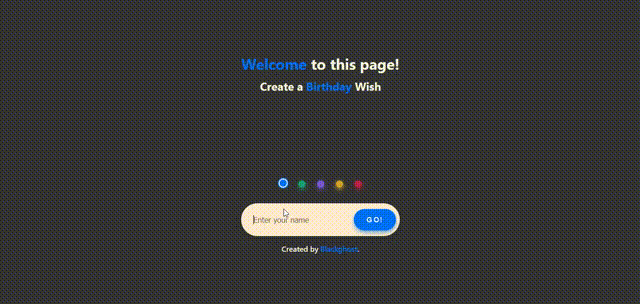

# :birthday: **Birthday Celebrating Website By Next.js 13.5.4** :cake: 

This website was built with [Next.js 13.5.4](https://nextjs.org/) and Typescript.
This project uses [App router](https://nextjs.org/docs)

## :heart: Local Setup

First, clone this repository:

```bash
git clone https://github.com/WebDeveloper0315/birthday-celerabrating-nextjs-13
```

Install the dependencies:

```bash
npm install
```

Then, run the development server:

```bash
npm run dev
```

Open [http://localhost:3000](http://localhost:3000) with your browser to see the result.

## :rose: Images


<br></br>
## :worried: Issues that have to work out in the next step
-   This project was constructed with TypeScript, but [this file](app/%5Bname%5D/page.js) is JavaScript file.<br>
I want to convert this file as TypeScript file, but I couldn't. <br>
Don't worry... This project runs well.
-   When I input the name with space (For example: [Jhon Smith]()), this shows as [Jhon%20Smith]().

## :thumbsup: Acknowledgements
**This was based on the *[Gourav Khunger](https://github.com/gouravkhunger/nextjs-birthday-wish)*'s project.**
<br>I upgraded to [Next.js 13.5.4](https://nextjs.org/) and [App Router](https://nextjs.org/docs).


## :handshake: License

```
MIT License

Copyright (c) 2023 Blackghost

Permission is hereby granted, free of charge, to any person obtaining a copy
of this software and associated documentation files (the "Software"), to deal
in the Software without restriction, including without limitation the rights
to use, copy, modify, merge, publish, distribute, sublicense, and/or sell
copies of the Software, and to permit persons to whom the Software is
furnished to do so, subject to the following conditions:

The above copyright notice and this permission notice shall be included in all
copies or substantial portions of the Software.

THE SOFTWARE IS PROVIDED "AS IS", WITHOUT WARRANTY OF ANY KIND, EXPRESS OR
IMPLIED, INCLUDING BUT NOT LIMITED TO THE WARRANTIES OF MERCHANTABILITY,
FITNESS FOR A PARTICULAR PURPOSE AND NONINFRINGEMENT. IN NO EVENT SHALL THE
AUTHORS OR COPYRIGHT HOLDERS BE LIABLE FOR ANY CLAIM, DAMAGES OR OTHER
LIABILITY, WHETHER IN AN ACTION OF CONTRACT, TORT OR OTHERWISE, ARISING FROM,
OUT OF OR IN CONNECTION WITH THE SOFTWARE OR THE USE OR OTHER DEALINGS IN THE
SOFTWARE.
```
