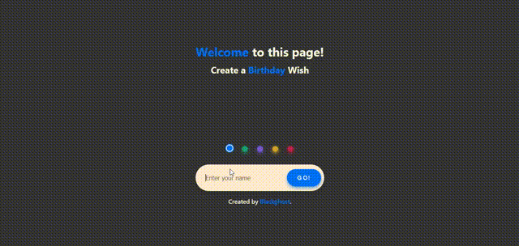

# :birthday: **Birthday Celebrating Website By Next.js 16** :cake:

A tiny site that turns a name into a shareable birthday page: animated greeting,
emoji confetti, music, a copyable link, and a one-click PNG you can send to
someone who does not click links from you.

Built with [Next.js 16](https://nextjs.org/) (App Router), React 19 and TypeScript.

## :heart: Local Setup

First, clone this repository:

```bash
git clone https://github.com/WebDeveloper0315/birthday-celerabrating-nextjs-13
```

Install the dependencies:

```bash
npm install
```

Then, run the development server:

```bash
npm run dev
```

Open [http://localhost:3000](http://localhost:3000) with your browser to see the result.

Other scripts:

```bash
npm run build      # production build (fails on type errors)
npm run lint       # ESLint, flat config
npm run typecheck  # tsc --noEmit
```

Requires Node.js 20.9 or newer.

## :rose: Images


## :white_check_mark: Previously known issues, now fixed

-   ~~This project was constructed with TypeScript, but `app/[name]/page.js` is a JavaScript file.~~
    The whole project is TypeScript now. The wall that made the conversion fail
    was `style={{ "--order": i }}` — TypeScript rejects CSS custom properties in
    `CSSProperties`, and the fix is a `as React.CSSProperties` assertion.
-   ~~When I input a name with a space (for example `Jhon Smith`), it shows as `Jhon%20Smith`.~~
    The name is `encodeURIComponent`-ed on the way into the URL and decoded on
    the way out, so spaces, slashes and emoji all survive the round trip.

Also fixed along the way:

-   The twelfth confetti set (`🌈🌧️🌞🌀🌟⛄`) had never fired once. The random
    helper computed `floor(random * (max - min)) + min`, which silently excluded
    the upper bound. Random picks now go through `randomItem()` so there is no
    bounds arithmetic left to get wrong.
-   The seventh confetti set was an empty array, so one burst in twelve had no
    emoji. It is the birthday set now.
-   `app/[name]/layout.tsx` rendered a second `<html>` and `<body>` inside the
    root layout's. It is gone; metadata lives in the page.
-   The wish was picked with `messages[random()]` inline in JSX, so it changed on
    every re-render — including every five seconds when the confetti timer fired,
    and again in the downloaded PNG. It is now derived from the name, so a link
    shows the same wish to everyone who opens it.
-   The download handler ran during render and called `setState` there. Capture
    now happens from an event handler against an off-screen card.
-   `saveAs()` was handed a data-URL string, which made file-saver open a tab
    instead of downloading; the file arrived as `downloads.html`. It gets a Blob.
-   The exported PNG was beige text on white — `confetti.png` is an opaque white
    image, so it painted over the dark background. The export card is styled as
    a light card with dark text.
-   `<audio autoPlay repeat>`: `repeat` is not an attribute (`loop` is), and the
    autoplay promise rejected unhandled on every browser with an autoplay policy.
    There is a play/pause button now.
-   `user-select: none` sat on `html, body`, so the birthday message could not be
    selected on a site built for sharing text.
-   The greeting is split with `Array.from`, not `charAt`, so emoji in a name no
    longer break into surrogate halves, and the split point is derived rather
    than hardcoded to the literal `15`.
-   Added `prefers-reduced-motion` support: no wavy text, no zoom, no confetti.
-   Added per-name metadata and a generated OpenGraph image, so a shared link
    unfurls with the recipient's name instead of a generic card.
-   Dropped five unused emoji packages, `confetti-js` and `tailwindcss` (which
    had no config and no directives anywhere).

## :warning: Version pinning

`eslint-config-next` 16 bundles `eslint-plugin-react` 7.37, whose peer range
stops at ESLint 9, and `typescript-eslint` 8, whose peer range stops below
TypeScript 6.1. ESLint and TypeScript are therefore held at 9.x and 6.x — the
newest releases the toolchain actually agrees on. Nothing else is pinned to a
range narrower than a caret, and none of them say `latest`.

## :thumbsup: Acknowledgements
**This was based on the *[Gourav Khunger](https://github.com/gouravkhunger/nextjs-birthday-wish)*'s project.**
<br>Upgraded to [Next.js 16](https://nextjs.org/) and the App Router.

## :handshake: License

```
MIT License

Copyright (c) 2023 Blackghost

Permission is hereby granted, free of charge, to any person obtaining a copy
of this software and associated documentation files (the "Software"), to deal
in the Software without restriction, including without limitation the rights
to use, copy, modify, merge, publish, distribute, sublicense, and/or sell
copies of the Software, and to permit persons to whom the Software is
furnished to do so, subject to the following conditions:

The above copyright notice and this permission notice shall be included in all
copies or substantial portions of the Software.

THE SOFTWARE IS PROVIDED "AS IS", WITHOUT WARRANTY OF ANY KIND, EXPRESS OR
IMPLIED, INCLUDING BUT NOT LIMITED TO THE WARRANTIES OF MERCHANTABILITY,
FITNESS FOR A PARTICULAR PURPOSE AND NONINFRINGEMENT. IN NO EVENT SHALL THE
AUTHORS OR COPYRIGHT HOLDERS BE LIABLE FOR ANY CLAIM, DAMAGES OR OTHER
LIABILITY, WHETHER IN AN ACTION OF CONTRACT, TORT OR OTHERWISE, ARISING FROM,
OUT OF OR IN CONNECTION WITH THE SOFTWARE OR THE USE OR OTHER DEALINGS IN THE
SOFTWARE.
```
